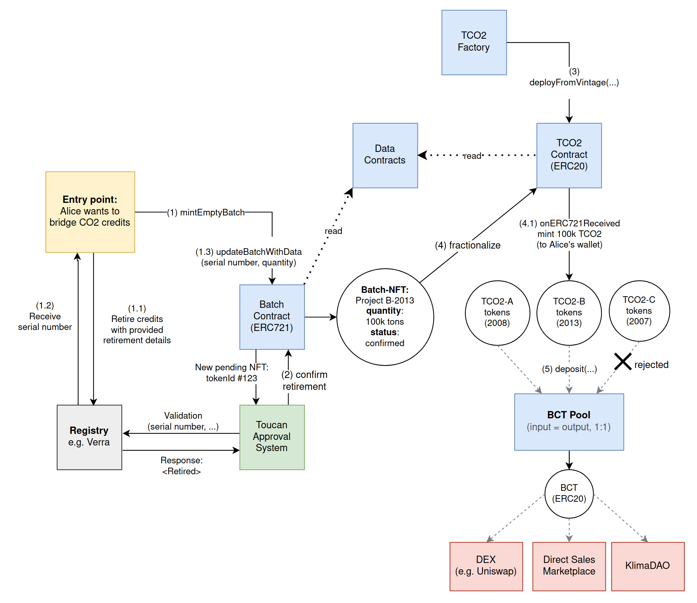

<!--
SPDX-FileCopyrightText: 2021 Toucan Labs

SPDX-License-Identifier: LicenseRef-Proprietary
-->

# Smart contracts of the Toucan Protocol
This repository contains only the smart contracts of Toucan Protocol. 
Since Toucan Protocol has upgradable smart contracts built with the UUPS proxy system by Open Zeppelin, changes of already deployed contracts are realized on-chain by an upgrade process, which is subject to scheduling. In order to view the latest state, we recommend viewing the implementation contract's source code on the respective block explorer (e.g. Polygonscan).

[toucan.earth](https://toucan.earth/)

---

# Toucan Protocol tokenizer

We're building a protocol that allows anybody to bring carbon credits on-chain via tokenization, directly sell or aggregate them in carbon index pools.

We want to bring carbon as an asset class to DeFi and unlock the myriad possibilities for its integration into decentralized products.

This repository contains an MVP for the tokenization of legacy (real-world) carbon credits.

## Tokenization overview

The diagram below depicts a simplified version of the Toucan Protocol.
The entry point is a user that wants to tokenize their carbon offset credits.
The project NFTs that contain meta data about offsetting projects are not depicted in this diagram for simplification purposes.

> See [our documentation][defi-refi] for more information about Toucan's goals and strategy, and the [carbon bridge].

### Steps 1-4: Bridging carbon offsets

1. Alice, the offset owner first mints an empty batch NFT. The NFT stores information related to the Verra retirement event, including serial number, project-vintage and quantity in tonnes.

   1.1. Alice retires the corresponding VCUs in the Verra registry with all the retirement details provided by the front-end, including the TXID of the transaction which minted the batch NFT in the retirement details. This links the retired [VCUs] in the registry to the batch NFT.

   1.2. The retirement (cancellation) of the VCUs generates a serial number in the Verra registry. Depending on whether Alice has direct access to Verra, she either gets the serial number herself, or her retailer sends it to her.

   1.3. Alice updates the NFT to add the serial number and the quantity of carbon tonnes retired. This provides a link back from the NFT to the VCUs in the Verra registry.

2. After updating the batch with data, a number of validation protocols on the pending batch are run, cross checking information in the NFT against the Verra registry, to confirm that the offsets exist as specified, and have been retired correctly. This protects against any double-counting of offsets.

3. During the confirmation process, it is ensured that the corresponding data tokens (ProjectData-NFT, ProjectVintageData-NFT) and a corresponding ERC20 contract (named TCO2) for fractionalizaton of the Batch-NFTs exist.

4. The Batch-NFT, which in this example represents 100k tons of CO2-equivalent offsets, is [fractionalized] into 100k ERC20 tokens. The supply of the TCO2 contract depends on the batches fractionalized, and the credit issuance specific to the project[^1].

   4.1. After the Batch-NFT is locked in the corresponding TCO2 contract, all of the minted ERC20 tokens are credited to Alice's wallet address via an `onERC721Received` hook.

[^1]: The `totalSupply` of the contract is the total TCO2s bridged so far, for this project & vintage. The TCO2 (ERC20) contract furthermore has a `supplyCap`, which is the based on the `totalVintageQuantity` attribute of the corresponding vintage. This is the amount of issued carbon offset tonnes for this project & vintage (not all of which might be bridged).

### Step 5: Pooling offset ERC20 tokens

The ERC20 tokens generated by bridging a batch of offsets may be added to a "pool", provided they match the entry criteria.
The pool holds ERC20 tokens from batches considered "equivalent enough" to be traded.

The offset owner transfers their qualifying ERC20 tokens to the pool, and receives pool tokens in return. These tokens are currently issued on a 1:1 basis - i.e. for each qualifying batch ERC20 token, the offset owner receives one BCT.

This is how Toucan provides deeper liquidity for tokenised carbon offsets, allowing them to participate in the wider DeFi ecosystem.

Currently, there are two pools available: [BCT] & [NCT](https://www.coingecko.com/en/coins/toucan-protocol-nature-carbon-tonne). More information about Toucan Carbon Pools is available [here][pools].

### Blockchain entities

- **Batch NFT**: Each batch of equivalent tonnes of carbon offsets that the project owner wishes to bridge on-chain is represented by an NFT containing metadata about the batch, including which Verra registry project generated the offsets, their vintage (period in which the emissions were avoided/captured), and quantity (in tonnes of CO2 equivalent). The Verra registry serial number of the batch is stored in the NFT to ensure that all batches are verifiable and unique.[^3]

  Currently, all Toucan batches consist of a number of [VCUs] on the [Verra registry]. i.e. The set of all carbon offsets which have been bridged via Toucan is a subset of the set of all VCUs.

[^3]: It is quite normal for a single project & vintage to have their credits retired/cancelled in multiple batches. A credit owner can chose to retire the corresponding carbon offsets in separate events rather than all at once. Or they might sell the credits to various brokers retailers, which then resell them to end-customers.

- **TCO2: Project-Vintage ERC20 Contract**: There is an ECR20 contract for each project-vintage, where each token represents a single tonne of carbon credits. These tokens are all equivalent (fungible) within the single ERC20 contract, but are not fungible wrt. credit tokens from different ERC20 contracts belonging to different vintages (and projects). There are usually multiple TCO2 contracts for the same project.

- **Credit/Offset owner**: The entity which owns/controls the Verra carbon offsets, and wants to use the Toucan bridge to turn them into blockchain tokens to trade or burn (burn functionality is coming soon).

#### Glossary

- **[Verra registry]**: a record of carbon offsets generated by different projects, and the single source of truth about when those offsets have been "retired" - i.e. when they are considered "spent", and can no longer be traded off-chain.
- **Project**: A real-world activity which generates/generated some amount of tonnes of carbon offsets, recorded as [VCUs] on the [Verra registry]

  For example, credits/offsets from a hydroelectric power plant in the United States are very different in terms of quality and attributes compared to a tonne of offsets from a direct air capture and sequestration project in Finland.

- **[BCT]**: Base Carbon Tonne. A tradeable ERC20 token, where 1 token represents 1 tonne of CO2-equivalent carbon offsets.
- **[NCT](https://www.coingecko.com/en/coins/toucan-protocol-nature-carbon-tonne)**: Nature Carbon Tonne. An ERC20-based token that represents 1 tonne of CO2-equivalent avoided or removed via a nature-based project, verified by Verra.
- **Vintage**: A monitoring period for a carbon offsetting project. Not always equivalent to one full calendar year. A single project can issue credits/offsets which are not fully equivalent (e.g. the way the carbon amount is measured might be different from one monitoring period (vintage) to the next). Usually, different vintages have different quality and attributes.

## Stack

- Smart contracts are written in [Solidity](https://soliditylang.org/)
- [Hardhat development environment](https://hardhat.org/) and various plugins
- [`ethers.js`](https://docs.ethers.io/v5/)
- [TheGraph](https://thegraph.com) for indexing of blockchain data

## Copyright / Licensing

The files in this repository are (currently) unlicensed but are likely to
be released under a Free / Open Source license later.

We have used the [`reuse`](https://github.com/fsfe/reuse-tool/) tool
to aim for compliance with [the REUSE
standard](https://reuse.software/), using SPDX identifiers where
appropriate.

[verra registry]: https://registry.verra.org/
[bct]: https://coinmarketcap.com/currencies/toucan-protocol-base-carbon-tonne/
[vcus]: https://verra.org/project/vcs-program/registry-system/verified-carbon-units-vcus/
[defi-refi]: https://docs.toucan.earth/protocol/introduction/defi-refi
[carbon bridge]: https://docs.toucan.earth/protocol/bridge/carbon-bridge
[fractionalized]: https://docs.toucan.earth/protocol/bridge/fractionalize
[pools]: https://docs.toucan.earth/protocol/pool/pools
[tco2s]: https://docs.toucan.earth/protocol/bridge/tco2-toucan-carbon-tokens
